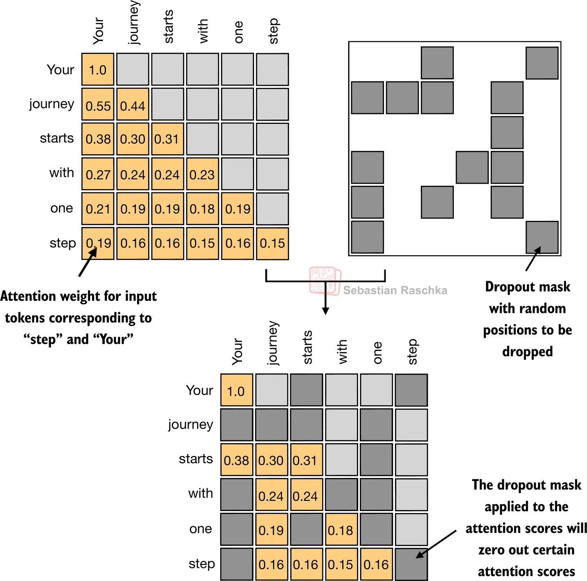
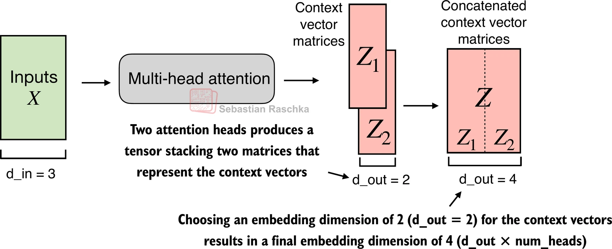
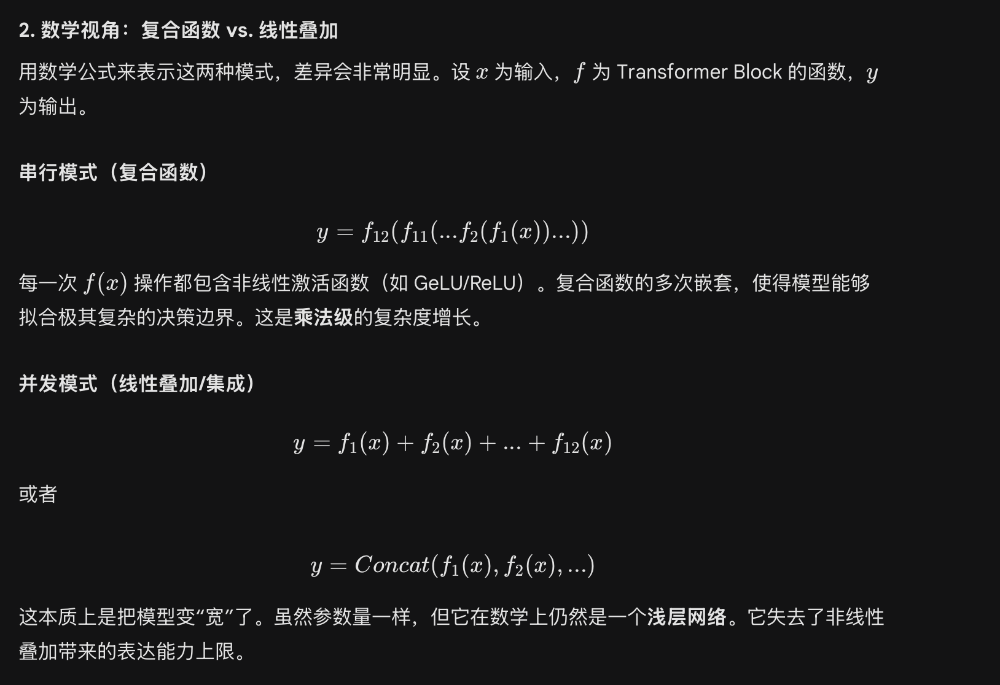

# 1. Scaled Causal Self-Attention

This chapter is a compact introduction to the core pieces behind transformer-based language models.

## 1.1 Why Attention Replaced Older Sequence Models

Before transformers, sequence tasks often relied on RNN encoder-decoder models. They worked, but they had several limitations:

- they processed tokens one step at a time
- long-range dependencies were hard to preserve
- training became less stable on long sequences
- parallelization on GPUs was limited

CNN-based approaches could capture local patterns, but modeling long-distance relationships still required stacking many layers.

Attention became important because it lets every position interact with every other position directly.

## 1.2 Self-Attention


Self-attention lets each token look across the entire sequence and weigh the importance of other tokens.

The output for a token is a weighted combination of information from the sequence. Those weights reflect relevance or similarity.

That is what makes attention powerful: instead of compressing everything into a single hidden state, the model can dynamically decide what to focus on.

## 1.3 Scaled Dot-Product Attention

For each input token, we want to build a contextualized representation that contains useful information from other positions.

The process is:

1. compute attention scores
2. normalize them with softmax
3. use the normalized weights to combine values

Softmax matters because it turns arbitrary scores into a probability-like distribution:

- all weights become non-negative
- the weights sum to 1
- large scores stand out more clearly

## 1.4 Q, K, and V

Instead of using the raw input directly, transformers project each token into three learned views:

- Query: what this token is looking for
- Key: what this token can be matched by
- Value: the information this token can contribute

```python
query_2 = x_2 @ W_query
key_2 = x_2 @ W_key
value_2 = x_2 @ W_value
```

For a full sequence:

$$
Q = XW_q,\quad K = XW_k,\quad V = XW_v
$$

And the attention score matrix is:

$$
\text{scores} = \frac{QK^\top}{\sqrt{d_k}}
$$


Separating Q, K, and V gives the model more expressive power:

- Q and K define how relevance is calculated
- V defines what information gets passed forward

## 1.5 Causal Masking

When generating text, the model should not look into the future.

That is why autoregressive models use causal masking: positions are prevented from attending to tokens that come later in the sequence.


The upper triangle of the attention matrix is masked out so each token can only see itself and earlier tokens.

## 1.6 Attention Dropout

During training, dropout can be applied to attention weights to reduce over-reliance on a single path.



This helps regularization and usually improves robustness.

## 1.7 Multi-Head Attention

Single-head attention gives only one set of attention weights. That is often too limited because language contains many kinds of relationships at once.

Multi-head attention solves this by running several attention projections in parallel.


Different heads can focus on different patterns such as syntax, reference, local structure, or semantics.



# 2. Transformer Block

A transformer block contains more than attention. A typical block includes:

- masked multi-head attention
- layer normalization
- a feed-forward network
- residual connections

## 2.1 Layer Normalization

Layer normalization stabilizes training by normalizing activations along the feature dimension.

It helps keep values in a more manageable range and makes optimization smoother.

## 2.2 Feed-Forward Network


After attention mixes information across tokens, the feed-forward network transforms each token representation independently.

A common pattern is:

1. expand the hidden dimension
2. apply a nonlinear activation
3. project back to the original dimension

This gives the model more capacity to learn rich transformations.

### 2.2.1 GELU

Transformers such as GPT usually use GELU rather than ReLU.

GELU is smoother and preserves weak negative signals instead of hard-clipping them to zero.


That typically leads to more stable optimization and better representation quality.

### 2.2.2 Example Implementation

```python
class FeedForward(nn.Module):
    def __init__(self, cfg):
        super().__init__()
        self.layers = nn.Sequential(
            nn.Linear(cfg["emb_dim"], 4 * cfg["emb_dim"]),
            GELU(),
            nn.Linear(4 * cfg["emb_dim"], cfg["emb_dim"]),
        )

    def forward(self, x):
        return self.layers(x)
```

## 2.3 Residual Connections

Residual connections add the original input back to the processed output:

```python
return x + processed_x
```

This matters for two reasons:

- gradients can flow more easily through deep networks
- the model keeps access to the original signal while adding refinements


# 3. Pretraining

The basic pretraining objective is next-token prediction.

## 3.1 Cross-Entropy and Perplexity

Cross-entropy measures how well the model assigns probability to the correct next token:

$$
\text{Loss} = - \frac{1}{N} \sum_{i=1}^{N} \log\left(p_{\text{target}}^{(i)}\right)
$$

Perplexity is the exponential form of that loss:

$$
\text{PPL} = e^{\text{Loss}}
$$

Lower loss and lower perplexity generally mean the model predicts the data more confidently.

## 3.2 Backpropagation and Optimization

Once the loss is computed, the model updates its parameters with gradient-based optimization.

The simple view is:

$$
W_{\text{new}} = W_{\text{old}} - \text{Learning Rate} \times \text{Gradient}
$$

In practice, models often use AdamW, which adds momentum, adaptive scaling, and weight decay.

# 4. Post-Training

## 4.1 Supervised Fine-Tuning

SFT is still next-token prediction, but the training data is structured as instruction-response pairs.

```python
<|im_start|>user
What is Java?
<|im_end|>
<|im_start|>assistant
A programming language.<|im_end|>
```

## 4.2 Loss Masking

During SFT, we usually compute loss only on the assistant response, not on the user prompt.

That means the labels for user tokens are masked out, often with `-100` in PyTorch.

# 5. A Few Quick Questions

## 5.1 Why Are Transformer Blocks Stacked Sequentially?

Because depth matters. Each layer builds on the representation produced by the previous one.

If all layers saw only the raw embedding in parallel, the model would lose the progressive abstraction that makes deep networks powerful.



## 5.2 Why Does QKV Matter?

QKV separates three roles:

- how relevance is computed
- how tokens are indexed for matching
- what information is passed on

Without that separation, the model would be much less expressive.

## 5.3 How Does the Model Distinguish Polysemy?

A token such as "apple" gets different contextualized representations depending on the surrounding sequence.

The attention pattern and subsequent transformations move the token into different regions of representation space for "apple the fruit" and "Apple the company."
