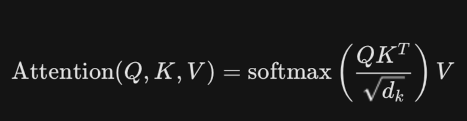
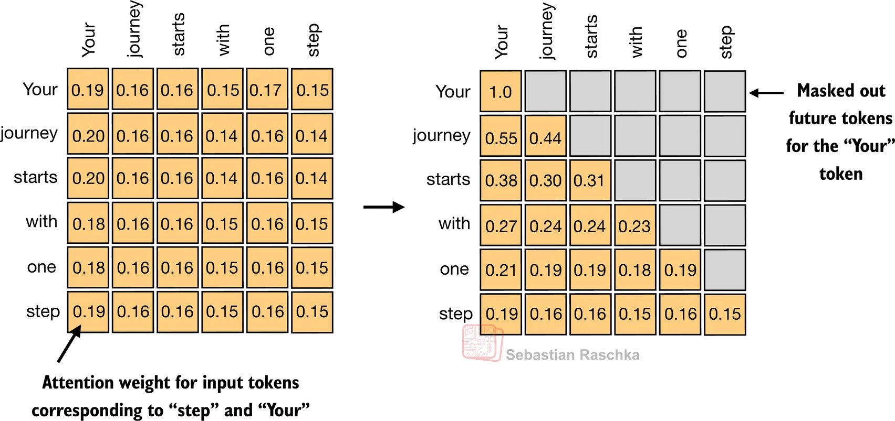
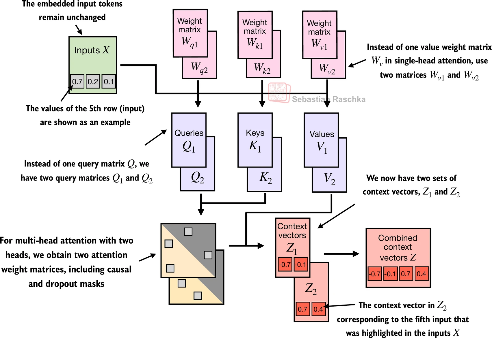
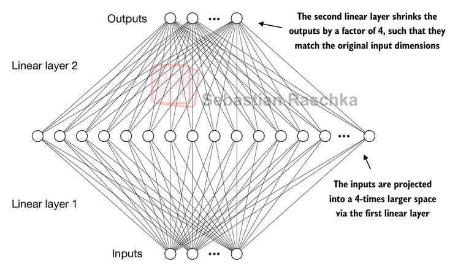
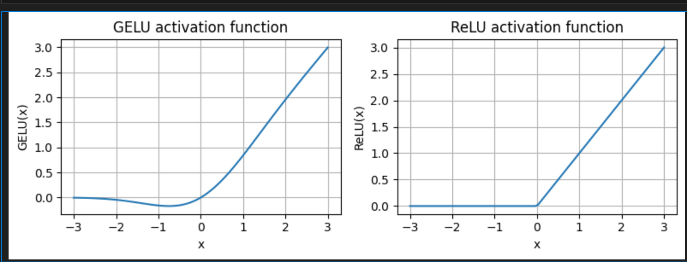
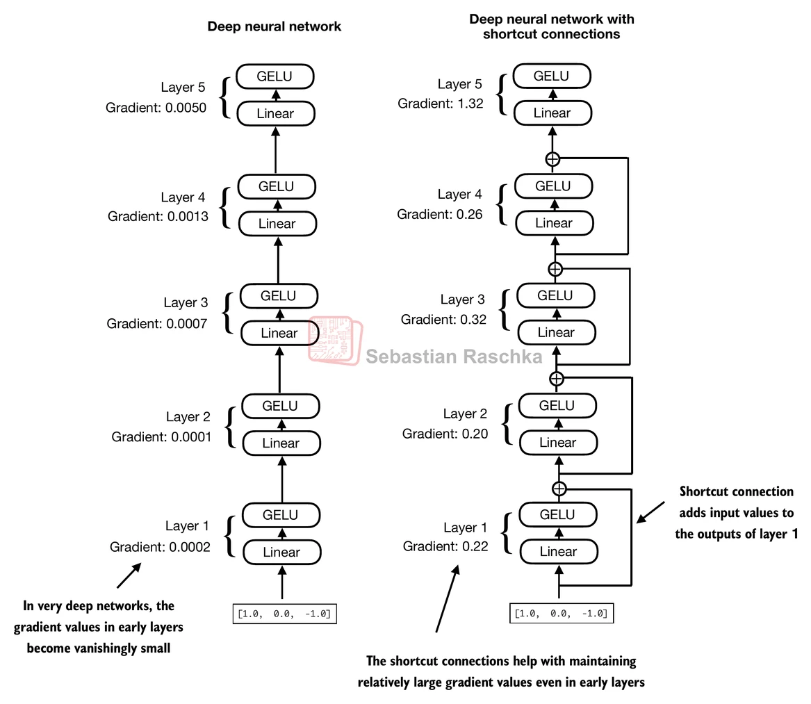

# 1. 多头缩放因果自注意力机制
## 1.1. 自注意力机制
### 1.1.1. Atttion 出现背景
在Transformer模型出现之前，编码器-解码器结构的RNN是机器翻译的常见选择。编码器将源语言的一串词元序列作为输入，并通过隐藏状态（一个中间神经网络层）编码整个输入序列的压缩表示。然后，解码器利用其当前的隐藏状态开始逐个词元进行翻译

RNN的一个缺点是它不能很好的记住句子开头的内容，特别是长句子。如果句子很长，编码器可能只能记住最后的部分，导致一些重要的信息丢失。  
这就意味着生成翻译时，解码器只能看到当前时刻的隐藏状态这个中间状态，无法查看最早期的输入是什么。

RNN 必须串行处理，t 时刻依赖 t−1，无法利用 GPU 并行加速。随着序列变长，梯度容易消失或爆炸，开头的信息传到结尾会丢失（“遗忘”问题）。

CNN 一层卷积只能看一个窗口（如 3x3），想看全局必须堆叠很多层（深层网络）。长捕捉局部特征（如短语），但在建模长距离语义关系时效率较低。

### 1.1.2. 注意力机制


Attention 是Transformer模型中的一种机制，它通过允许一个序列中的每个位置与同一序列中的其他所有位置进行交互并**权衡其重要性**，来计算出更高效的输入表示。

一个输入既可以是 Key，也可以是 Value，也可以是 Query。不考虑多头注意力机制的情况下，输出其实是输入的加权和，权重来自于本身，也就是自己与各个向量之间的相似度。

在自注意力机制中，“自”指的是该机制通过关联单个输入序列中的不同位置来计算注意力权重的能力。它可以评估并学习输入本身各个部分之间的关系和依赖，比如句子中的单词或图像中的像素。

> 在句子“猫追逐着小狗”的处理中，自注意力机制会计算“猫”和“追逐”之间、“追逐”和“小狗”之间的关系，以及它们如何共同影响句子的理解。
>
> 比如在机器翻译中，输入序列和输出序列之间存在关联。注意力机制会在这两个序列间寻找关联，而不是单纯在输入序列内部进行计算。
>

### 1.1.3. 缩放注意力机制

自注意力要做的事，就是给序列里的每个输入 $x^{(i)}$ 算出一个新的向量 $z^{(i)}$，这个向量里面综合了序列中其他所有位置的信息。

所谓「上下文向量」$z^{(i)}$，可以理解为：
它是一种包含整个序列信息的表示，专门用来让某个位置的 Token 在计算时同时“带上”其他位置的信息，从而得到更有用的特征。

接下来第一步，就是先算出中间量——注意力分数。

比如我们现在只看第二个 Token，它的上下文向量 $z^{(2)}$ 是这样来的：

先把第二个 Token $x^{(2)}$ 和序列中每个 Token $x^{(j)}$ 之间的相关性算出来（可写成 $x^{(2)} \cdot x^{(j)}$ 这一类形式），得到一组分数，然后再按这些分数对所有 $x^{(j)}$ 做加权组合，最后的结果就是 $z^{(2)}$。


如果我们直接拿点积分数当权重，会有两个问题：

1. 分数大小不好控制：有的大，有的小，范围不统一，不好解释；

2. 不能直接当概率用：这些分数本身不满足“非负且和为 1”。

用 Softmax 之后：

- 所有分数都会变成 0 到 1 之间的数；

- 所有权重加起来刚好是 1，可以看成一组概率；

- 大的分数会更突出，小的分数会被压下去，有利于模型更清楚地关注重要位置，也有更好的梯度性质，训练更稳定。

当我们对查询 $x^{(2)}$ 的注意力分数做完 Softmax 归一化，得到一组注意力权重后，最后一步就是算上下文向量 $z^{(2)}$：把所有输入向量 $x^{(1)}$ 到 $x^{(T)}$ 按照对应的注意力权重做加权求和，结果就是 $z^{(2)}$。

$$
z^{(2)} \;=\; \sum_{j=1}^{T} \text{Softmax}\big(\,x^{(2)} \cdot x^{(1:T)}\,\big) \; x^{(j)}
$$

### 1.1.4. 带训练权重的缩放自注意力机制

在前一小节中，我们是直接用输入向量之间的点积来计算注意力分数。  
现在，在同样的「缩放点积注意力」框架下，引入三组在训练过程中更新的权重矩阵：$W_q, W_k, W_v$。  
它们把原始输入向量投影到三个不同的空间，用来分别表示 Query、Key 和 Value。

设输入序列的每个元素向量为 $x_i \in \mathbb{R}^d$，则有：

$$
q_i = x_i W_q,\quad k_i = x_i W_k,\quad v_i = x_i W_v
$$

以第 2 个位置为例，对应的计算可以写成：

```python
query_2 = x_2 @ W_query
key_2 = x_2 @ W_key
value_2 = x_2 @ W_value
```

对整个序列，可以把所有输入按行堆成矩阵 $X \in \mathbb{R}^{T \times d}$，一次性算出所有的 $Q, K, V$：

$$
Q = X W_q,\quad K = X W_k,\quad V = X W_v
$$

注意力分数仍然是通过 Query 和 Key 的点积得到，只是现在用的是投影后的 $Q$ 和 $K$，而不是原始的 $X$。  
矩阵形式可以写成：

$$
\text{scores} = \frac{Q K^\top}{\sqrt{d_k}}
$$



**查询类似于数据库中的搜索查询**，表示模型当前关注或试图理解的项（比如句子中的一个词元），用来“发问”。

**键类似于用于数据库索引和搜索的键**，每个输入项（每个词元）都会对应一个键，用来被查询匹配，“表明自己可以回答什么问题”。

**值类似于数据库中键值对的值**，表示输入项的实际内容或表示。当模型发现某些键与当前查询最相关时，就会取出对应的值做加权求和，形成上下文向量。如果只用一套向量而不区分 Q / K / V，模型的表达能力会受限。

- **Q / K 的分离**：让模型在“提问视角”和“被提问视角”上拥有不同的表征空间，同一个词作为 Query 和作为 Key 时可以扮演不同角色。
- **Value 的分离**：把“算权重的空间”和“存信息的空间”解耦；注意力本身只决定“看谁”，真正传递过去的信息来自 Value。

> 句子示例：“猫追老鼠，它跑得很快”  
> 当模型处理“它”时：
> - Query：是“它”的提问视角——“我到底指谁？”
> - Key：来自整句所有词元，表示每个词能作为指代目标的“身份标签”
> - Value：是每个词元真正携带的语义内容
>
> 注意力权重更偏向“老鼠”的 Key 时，对应的 Value（“老鼠”的信息）就会被更多地加权到“它”的上下文里，帮助模型理解“它”指的是谁。

总结一句话：**Q/K/V 本质上都是从同一输入向量投影出来的三个视角**：
- Query = 我的问题
- Key = 你能回答的问题标签
- Value = 你真正能提供的内容


## 1.2. 多头因果注意力机制
### 1.2.1. 因果注意力机制（Mask）

前面我们讲了自注意力机制：每个词元可以通过 Query 去“看”整个序列中所有词元的 Key，然后根据注意力权重对 Value 进行加权求和。但这里有个问题：**在生成文本时，模型不应该“看到未来”**。

想象一下，如果让你预测一句话的下一个词，你只能基于已经说出来的部分来猜，而不能提前知道后面要说什么。GPT 这样的自回归模型也是如此：在预测第 $t$ 个词元时，它只能看到第 $1$ 到第 $t-1$ 个词元（以及当前词元自己），不能看到第 $t+1$ 个及之后的词元。

**因果注意力机制（Causal Attention）**就是为了解决这个问题：在计算注意力分数时，把“未来”的词元屏蔽掉。具体做法是：**在注意力权重矩阵中，把对角线以上的部分全部置为负无穷（或一个很大的负数），这样经过 softmax 之后，这些位置的权重就会变成 0**。



看上图，注意力权重矩阵被“切掉”了右上角（对角线以上），每一行只能看到自己及左边的词元。比如处理“journey”这个词时（第 2 行），它只能关注到“Your”（第 1 行）和它自己，无法看到后面的词元。这样，模型在生成时就不会“作弊”了。


### 1.2.2. 利用 dropout 掩码
dropout是深度学习中的一种技术，通过在计算完 Attention Weights 后，随机丢弃一部分权重（置零），剩余部分按比例放大（scaling）。这种方法**有助于减少模型对特定隐藏层单元的依赖，从而避免过拟合。**

例如，假设某个词元的注意力权重向量是 $[0.1, 0.3, 0.4, 0.2]$，总和为 1.0。如果 dropout 随机丢弃了第 3 个权重（0.4），那么剩下的权重 $[0.1, 0.3, 0.2]$ 会被按比例放大到 $[0.167, 0.5, 0.333]$，使得总和仍然为 1.0。这样，模型在训练时不能总是依赖同一条注意力路径，必须学会更鲁棒的特征表示。

> **dropout仅在训练期间使用，训练结束后会被取消。**


## 1.3. 单头注意力机制扩展到多头注意力机制
单头注意力机制（Single-Head Attention）在计算时，对于序列中的每一个词，只生成**一组**注意力权重。这意味着模型在每一个时刻，只能关注输入序列中的某一种特定的关系或特征。

然而，自然语言是非常复杂的，词与词之间存在多种不同层面的关联。例如，在句子"银行存了很多钱"中：
- "银行"和"存"之间存在动作关系（银行执行存的动作）
- "银行"和"钱"之间存在语义关系（银行与钱相关）
- "很多"和"钱"之间存在数量关系（修饰钱的多少）

如果只用一组注意力权重，模型很难同时捕捉这些不同层面的关系。**多头注意力机制的核心目的，是为了让模型能够"并行地"从不同的"子空间"捕捉丰富的信息。**

### 1.3.1. 叠加多头注意力机制

在实际操作中，实现多头注意力需要构建多个自注意力机制的实例，每个实例都有其独立的权重，然后将这些输出进行合成。虽然这种方法的计算量可能会非常大，但它对诸如基于Transformer的大语言模型之类的模型的复杂模式识别是非常重要的。

如下图多头注意力模块的结构，它是由多个单头注意力模块依次叠加在一起组成的：



多头注意力的主要思想是多次（并行）运行注意力机制，每次使用学到的不同的线性投影——这些投影是通过将输入数据（比如注意力机制中的查询向量、键向量和值向量）乘以权重矩阵得到的。

具体来说，假设我们有两个头（Head 1 和 Head 2）：
- Head 1 使用独立的权重矩阵 $W_{q1}$、$W_{k1}$、$W_{v1}$ 计算，得到上下文向量 $Z_1$
- Head 2 使用独立的权重矩阵 $W_{q2}$、$W_{k2}$、$W_{v2}$ 计算，得到上下文向量 $Z_2$
- 最后把 $Z_1$ 和 $Z_2$ 合并（通常是拼接）成最终的上下文向量 $Z$

因此，我们不是使用一个单一的矩阵 $W_v$ 来计算值矩阵，而是在一个有两个头的多头注意力模块中，现在有两个值权重矩阵：$W_{v1}$ 和 $W_{v2}$。这样同样适用于其他的权重矩阵，比如 $W_q$ 和 $W_k$。


GPT 等大模型通常使用 8、16 甚至更多个头，每个头可以学习关注不同类型的语言关系，从而提升模型的理解能力。


# 2. Transformer 模块

前面我们讲了多头注意力机制，它负责计算词元之间的关系。但一个完整的 Transformer 模块还包含其他几个重要组件：

+ **掩码多头注意力机制（Masked Multi-Head Attention）**：计算词元之间的关系（前面已经介绍过）。
+ **前馈网络（Feed-Forward Network，FFN）**：对注意力机制输出的特征进行进一步处理和转换。
+ **残差连接（Shortcut Connections）**：把输入直接加到输出上，这样可以让梯度更好地传播，避免训练时梯度消失。
+ **层归一化（Layer Normalization）**：在注意力模块和前馈网络之前，把数据标准化一下，让训练更稳定。

## 2.1. 层归一化操作

层归一化就是把输入数据的每个特征维度都标准化：减去均值，再除以标准差。这样处理后，每个特征的均值变成 0，方差变成 1。

举个例子，假设某个特征向量是 $[2, 4, 6]$，均值是 4，标准差约 1.63。归一化后变成 $[-1.22, 0, 1.22]$，均值变成 0，方差变成 1。

为什么要这么做？因为神经网络在训练时，如果数据分布不稳定，有些特征值会变得特别大或特别小，导致训练过程不稳定，权重更新困难。归一化后，所有特征都在相似的数值范围内，训练就更稳定了，权重也能更快收敛到合适的值。

## 2.2. 前馈网络与激活函数
### 2.2.1. FFN




前面我们讲了多头注意力机制，它负责找出词元之间的关系。但光找出关系还不够，模型还需要对这些关系进行进一步的处理和转换。这就是前馈网络（Feed-Forward Network，FFN）要做的事情。

FFN 的工作流程很简单：先把数据维度扩大，处理一下，再缩小回原来的维度。

具体来说：
1. **扩大维度**：把输入从 768 维（假设是 GPT-2 的嵌入维度）扩大到 3072 维（4 倍）。
2. **非线性处理**：用 GELU 激活函数处理一下，提取更复杂的特征。
3. **缩小维度**：再压缩回 768 维，和输入维度一致。

为什么要先扩大再缩小？主要是为了增加可训练参数的数量。比如 GPT-2 有 1.24 亿参数，其中约 2/3 都在这些 FFN 的权重矩阵里。参数越多，模型能学到的模式就越复杂，表达能力就越强。

举个例子，假设输入是"银行存了很多钱"这句话经过注意力机制处理后的特征向量（768 维）。FFN 会：
- 先把它扩展到 3072 维，这样就有更多空间来组合和转换特征
- 用 GELU 激活函数进行非线性变换，比如把某些特征组合起来，或者抑制某些特征
- 再压缩回 768 维，输出处理后的特征向量

这个过程让模型能够提取和转换更复杂的特征，比如识别出"银行"和"存"之间的动作关系，或者"很多"和"钱"之间的数量关系。

---

扩展维度的本质就是乘以一个巨大的权重矩阵（Weight Matrix）。这个矩阵可以被训练，而且权重至关重要。

**权重矩阵就是模型存储知识的地方。** 举个例子，模型学到"巴黎是法国首都"这个事实，实际上就是通过调整这些矩阵里的数值来实现的。

训练过程是这样的：
- **初始化时**：矩阵里的数值是随机生成的（比如用正态分布），这时候模型还不会做任何有用的预测。比如权重可能是 $[0.1, -0.3, 0.5, ...]$ 这样的随机数。
- **训练时**：通过反向传播算法，不断调整矩阵里的数值。比如某个权重是 0.5，但梯度显示应该改成 0.6，那就调整。经过大量数据的训练，这些数值会逐渐收敛到合适的值。
- **训练后**：矩阵里的数值固定下来，这些数值就代表了模型学到的知识。比如某些权重组合在一起，就能让模型识别出"巴黎"和"法国"之间的关系。

不同的权重数值大小不同，意义也不同：
- 数值大的权重（比如 0.9）：表示这个连接很重要，对最终结果影响大。比如识别"银行"这个词时，某些权重可能特别大。
- 数值小的权重（比如 -0.01）：表示这个连接影响很小，基本可以忽略。比如某些不相关的特征组合，对应的权重就会很小。


### 2.2.2. GELU

前面我们讲了 FFN 会先把数据维度扩大，然后处理，再缩小。这个"处理"步骤，就是用激活函数来完成的。

**激活函数的作用是什么？**

如果没有激活函数，神经网络就只是做矩阵乘法。比如输入是 $[1, 2, 3]$，经过一个线性层可能变成 $[2, 4, 6]$（只是乘以 2），再经过一个线性层可能变成 $[4, 8, 12]$（再乘以 2）。无论有多少层，最终结果都是输入的线性组合，本质上和一层没什么区别。

激活函数的作用就是引入非线性。它会把输入值按照某种规则转换，比如把负数变成 0，或者把小的正数放大。这样，多层网络就能组合出更复杂的模式，而不是简单的线性叠加。

**为什么要用 GELU？**

GPT 用的是 GELU（Gaussian Error Linear Unit），而不是更常见的 ReLU。两者的区别是：

- **ReLU**：如果输入是正数，直接输出；如果是负数，输出 0。比如输入是 -0.5，输出就是 0。
- **GELU**：输入是正数时，输出和 ReLU 差不多；但输入是负数时，不会直接变成 0，而是会有一个很小的值。比如输入是 -0.5，输出可能是 -0.1（很小，但不是 0）。

为什么要保留负数的微弱信号？因为在训练时，梯度（用来更新权重的值）需要反向传播。如果负数直接变成 0，梯度就传不过去了，对应的权重就更新不了。GELU 保留了这些微弱信号，让梯度能传过去，这样模型就能学到更复杂的模式。

**GELU 的数学公式：**

**$\text{GELU}(x) \approx 0.5 \cdot x \cdot \left(1 + \tanh\left[\sqrt{\frac{2}{\pi}} \cdot \left(x + 0.044715 \cdot x^3\right)\right]\right)$**

这个公式看起来复杂，但本质上就是：输入值越大，输出越大；输入值是负数时，输出是一个很小的负数（接近 0 但不是 0）。



从图上可以看到，GELU 是一条平滑的曲线，而 ReLU 是一条折线（在 0 处有个尖角）。平滑的曲线有什么好处？在训练时，优化器（比如 Adam）更容易找到最优解。如果函数有尖角，优化器可能会在尖角附近"卡住"，导致训练不稳定或者收敛慢。

**GELU 的意义：**

1. **保留梯度信息**：负数输入不会直接变成 0，梯度能传过去，让模型能学到更复杂的模式。
2. **训练更稳定**：平滑的曲线让优化器更容易找到最优解，训练过程更稳定。
3. **表达能力更强**：相比 ReLU，GELU 能捕捉到更细微的特征差异，提升模型的表达能力。


**代码实现：**

把前面说的 FFN 和 GELU 组合起来，就是完整的 FeedForward 模块：

```python
class FeedForward(nn.Module):
    def __init__(self, cfg):
        super().__init__()
        self.layers = nn.Sequential(
            nn.Linear(cfg["emb_dim"], 4 * cfg["emb_dim"]),  # 扩大维度：768 -> 3072
            GELU(),                                           # 激活函数：引入非线性
            nn.Linear(4 * cfg["emb_dim"], cfg["emb_dim"]),  # 缩小维度：3072 -> 768
        )
    
    def forward(self, x):
        return self.layers(x)
```

**代码解释：**

这个模块很简单，就是把三个步骤串起来：
- `nn.Linear(cfg["emb_dim"], 4 * cfg["emb_dim"])`：第一个线性层，把输入从 768 维扩大到 3072 维（乘以 4）。这一步就是矩阵乘法，输入向量乘以一个 768×3072 的权重矩阵。
- `GELU()`：激活函数，对扩大后的向量进行非线性变换。这一步很关键，如果没有它，后面的线性层就只是再做一次矩阵乘法，整个模块就变成线性的了。
- `nn.Linear(4 * cfg["emb_dim"], cfg["emb_dim"])`：第二个线性层，把 3072 维压缩回 768 维。这一步也是矩阵乘法，乘以一个 3072×768 的权重矩阵。

**举个例子：**

假设输入是"银行存了很多钱"这句话经过注意力机制处理后的特征向量（768 维），比如是 $[0.1, 0.3, -0.2, ..., 0.5]$。

1. **第一个线性层**：把这个向量乘以权重矩阵，得到 3072 维的向量，比如 $[0.2, 0.1, -0.3, ..., 0.4]$。这一步给了模型更多空间来组合特征。
2. **GELU 激活**：对每个元素应用 GELU 函数。比如 -0.3 经过 GELU 后可能变成 -0.05（很小的负数，但不是 0）。这一步引入非线性，让模型能学到更复杂的模式。
3. **第二个线性层**：把 3072 维的向量压缩回 768 维，比如 $[0.15, 0.25, -0.1, ..., 0.45]$。这一步把处理后的特征重新组合，输出和输入维度相同，但内容已经转换过了。

**为什么要这样设计？**

整个过程就是：扩大 → 处理 → 缩小。为什么要先扩大再缩小？

1. **增加参数数量**：扩大维度后，权重矩阵变大了（768×3072 和 3072×768），可训练参数变多了。参数越多，模型能学到的模式就越复杂。
2. **提取复杂特征**：在更大的空间里，模型可以把不同的特征组合起来，提取更复杂的模式。比如把"银行"和"存"这两个特征组合，识别出动作关系。
3. **保持维度一致**：最后压缩回原来的维度，这样输出和输入维度相同，可以方便地接入下一层（比如残差连接）。

最终输出和输入维度相同（都是 768 维），但内容已经经过转换了，包含了更复杂的特征组合。


## 2.3. 残差连接 (Residual Connection)

前面我们讲了注意力机制和 FFN，它们都是对输入进行转换，然后输出处理后的结果。FFN 最后提到"可以方便地接入下一层（比如残差连接）"，那残差连接到底是什么？为什么要用它？

**残差连接做了什么？**

很简单，就是把原始输入直接加到处理后的输出上。公式是：`输出 = 原始输入 + 处理后的结果`

具体来说，假设输入是"银行存了很多钱"这句话经过注意力机制处理后的特征向量（768 维），比如是 $[0.1, 0.3, -0.2, ..., 0.5]$。经过 FFN 处理后，可能变成 $[0.15, 0.25, -0.1, ..., 0.45]$。

- **没有残差连接**：输出就是 $[0.15, 0.25, -0.1, ..., 0.45]$，原始输入 $[0.1, 0.3, -0.2, ..., 0.5]$ 就丢失了。
- **有残差连接**：输出是 $[0.1, 0.3, -0.2, ..., 0.5] + [0.15, 0.25, -0.1, ..., 0.45] = [0.25, 0.55, -0.3, ..., 0.95]$，原始输入被保留下来了。

**为什么要这么做？**

GPT 有很多层（GPT-2 有 12 层，GPT-3 有 96 层）。训练时，需要从输出层反向传播梯度到每一层，更新权重。如果没有残差连接，梯度在传播过程中会越来越小，这就是"梯度消失"问题。

什么是梯度消失？训练时，我们需要计算损失函数对每个权重的梯度，然后更新权重。梯度是从输出层反向传播到输入层的。

如果没有残差连接，梯度在反向传播时是"连乘"关系。比如第 12 层的梯度是 0.5：
- 传到第 11 层，可能变成 0.25（乘以某个小于 1 的数）
- 传到第 10 层，可能变成 0.125
- 传到第 9 层，可能变成 0.0625
- ...
- 传到第 1 层，可能就接近 0 了（比如 0.0002）

梯度太小，权重就更新不了，前面的层就学不到东西。

有了残差连接后，梯度可以沿着两条路径传播：
1. **处理路径**：沿着 FFN 或注意力层传播，梯度可能会变小（比如 0.0002）
2. **直接连接**：直接从输出连到输入，梯度是 1（因为 $x + processed_x$ 对 $x$ 的导数是 1）

即使处理路径上的梯度很小（比如 0.0002），直接连接的梯度（1）也能传过去。最终第 1 层收到的梯度是 0.0002 + 1 = 1.0002，足够更新权重了。

<!--从图片可以看到，没有残差连接时，第 1 层的梯度只有 0.0002，几乎更新不了。有了残差连接后，第 1 层的梯度是 0.22，足够更新权重了。-->



**代码实现：**

把前面说的残差连接用代码写出来，就是这样的：

```python
class ResidualBlock(nn.Module):
    def forward(self, x):
        # x: 原始输入，比如"银行存了很多钱"的特征向量 [0.1, 0.3, -0.2, ..., 0.5]
        
        # 经过某些层处理（比如 Attention 或 FFN）
        processed_x = self.some_layer(x)  # 处理后变成 [0.15, 0.25, -0.1, ..., 0.45]
        
        # 关键一步：把处理后的结果，和原始输入 x 相加
        return x + processed_x  # 输出 [0.25, 0.55, -0.3, ..., 0.95]
```

代码很简单，就是三行：
- 第一行：保存原始输入 `x`
- 第二行：对输入进行处理，得到 `processed_x`
- 第三行：把两者相加，返回结果

**残差连接的意义：**

1. **解决梯度消失**：让梯度能顺利传到前面的层，即使网络很深（比如 96 层），前面的层也能收到足够的梯度来更新权重。
2. **允许更深的网络**：没有残差连接，网络太深就训练不了（梯度传不过去）。有了残差连接，GPT-2 可以有 12 层，GPT-3 可以有 96 层，模型能学到更复杂的模式。
3. **保留原始信息**：即使某个层处理得不好，原始输入信息也能保留下来。比如 FFN 把某个特征改错了，但原始输入还在，不会完全丢失。


# 3. 预训练
## 3.1. 困惑度和交叉熵
预训练的目标很简单：让模型把“真实下一个 token”的概率预测得更高。对应的损失函数通常用 **交叉熵（Cross-entropy Loss）**，本质就是 **负的平均对数概率**（Negative Average Log Probability）。

做法也很直接：对每个位置，取出模型给真实目标 token 的概率 $p_{\text{target}}$（来自 Softmax），算 $\log(p_{\text{target}})$，对所有位置取平均，再取负号（因为 $p<1$ 时 $\log(p)$ 为负）。

$$\text{Loss} = - \frac{1}{N} \sum_{i=1}^{N} \log\left(p_{\text{target}}^{(i)}\right)$$

- **N 是什么**：参与计算的样本数（通常就是 batch 里所有位置的 token 数）。除以 $N$ 是为了做“平均”，让 loss 的尺度不随 batch/序列长度简单变大。

---

困惑度（Perplexity, PPL）是交叉熵损失的**指数形式**，常用来把 loss 变成更直观的量。

$\text{PPL} = e^{\text{Loss}}$

---

## 3.2. 反向传播（Backpropagation）**And **梯度下降（Gradient Descent）
有了 loss 之后，接下来就是用 **反向传播 + 梯度下降** 去更新参数。

$W_{\text{new}} = W_{\text{old}} - \text{Learning Rate} \times \text{Gradient}$

**Learning Rate（学习率）**：每次更新的“步子有多大”。例如代码中设置为 `0.0004`，就是让参数每次只微调一点点，避免震荡发散。

---

$W_{\text{new}} = W_{\text{old}} - \text{Learning Rate} \times \frac{\text{Momentum}}{\sqrt{\text{Variance}} + \epsilon} - \text{Decay}$

**高级优化器（AdamW）**：实际使用的不是最简单的减法，而是 **AdamW** 算法。它比普通减法更聪明

它会考虑**惯性**（Momentum，之前往哪走，现在继续往哪冲）和**地形**（Variance，陡峭的地方走慢点，平坦的地方走快点）

+ **Momentum (First Moment)**：**一阶动量（梯度的均值）**。通常符号为 mt。它不仅仅看当前的梯度，还参考了**过去几次的梯度方向**（惯性）。这有助于冲破局部极小点，加速收敛。如果过去几次梯度都指向同一个方向，它会加速冲过去（像滚下山坡的球）。
+ **Variance (Second Moment)**：**二阶动量（梯度的方差/未中心化的方差）**。它记录了梯度的**变化幅度**。如果某个参数的梯度一直很大（很陡），Variance 就大，分母变大，更新步长就会变小（自动制动）；反之则步长变大。这实现了**自适应学习率**。它会为每一个参数单独调整学习率。经常变化的参数，步子迈小点；几乎不怎么变的参数，步子迈大点。
+ **权重衰减（Decay）**：在更新时，顺便把权重值稍微缩小一点点（乘以一个小于 1 的系数），防止参数数值过大导致过拟合。

# 4. 后训练
## 4.1. SFT 监督微调
### 4.1.1. SFT 的本质
监督微调（Supervised Fine-Tuning, SFT）在物理本质上，确实就是把“问题”和“答案”拼成一串长字符串，然后扔给模型去做“预测下一个词”的训练。

在 SFT 中，我们必须把“用户的问题”和“期望的回答”强行拼在一起，加上特殊的**分隔符**。

+ **原始数据**：
    - Question: "Java 是什么？"
    - Answer: "一门编程语言。"
+ **SFT 拼出来的 String（送进模型的 Input）**

```python
<|im_start|>user\n
Java 是什么？\n
<|im_end|>\n
<|im_start|>assistant\n
一门编程语言。<|im_end|>
```

---

### 4.1.2. Loss Masking
但是 SFT 和预训练最大的不同点是 **Loss Masking（只对“回答”算罚分）**：

+ **预训练**：模型要预测**每一个词**。它既要预测“Java”，也要预测“是什么”，也要预测“编程语言”。
+ **SFT**：我们**不希望**模型去学习“如何预测用户的问题”（那是用户的事），我们只希望模型学习“如何生成助手的回答”。

**操作逻辑：** 我们在计算交叉熵损失（Cross-Entropy Loss）时，会把“用户问题”部分的 Label 设置为 `**-100**`（PyTorch 中默认忽略的索引）。

+ **Input**: `[<User>, Java, 是, 什么, <Asst>, 一门, 编程, 语言]`
+ **Target (Label)**: `[-100, -100, -100, -100, -100, 一门, 编程, 语言]`

**结果**：

+ 当模型在处理“用户问题”部分时，无论它预测得对不对，**Loss 都是 0，梯度也是 0**。模型不会因为猜不出用户想问什么而被惩罚。
+ 只有当模型进入“助手回答”部分时，算错才会产生 Loss，才会反向传播修改权重。

# 5. 答疑
#### 5.1. 为什么 Transformer 在计算12次 TransfomerBlock 的时候选择了 串行，上一次输入作为下一次输出。而不能选择并发，都是用初始值
Transformer Block 选择串行 是因为深度学习的核心在于特征的逐层抽象与累积。

+ 串行 = 深度（Depth）：通过多次非线性变换，将原本的词向量从“字面意思”逐步转化为“上下文语义”。
+ 并发 = 宽度（Width）：如果12层都并发处理初始值，这就变成了一个“只有1层但非常宽”的浅层网络，它失去了推理复杂逻辑的能力。

神经网络之所以叫“深度”学习（**Deep** Learning），是因为由于层数的增加，模型能够学到更高级的特征。

+ **第 1-2 层**：可能只关注词性、简单的词法搭配（例如“吃”后面通常接食物）。
+ **第 5-6 层**：开始理解短语结构和句法依存（例如指代消歧，知道“它”指的是前面的哪一个名词）。
+ **第 11-12 层**：理解全文的语义、情感、因果逻辑（例如理解反讽或复杂的推理）。

**如果改成并发（并行）：** 所有12个层都直接读取原始的 Embedding（初始值）。这意味着第12层和第1层看到的是一样的东西。它们只能各自提取一些浅层的特征然后拼凑在一起，无法形成“理解上的飞跃”。


#### 5.2. QKV 矩阵是什么？QKV 的作用是什么？没有 QKV 可不可以？QKV 在整个计算中起到了什么作用？
+ Q (Query - 查什么)：当前 Token 想要寻找什么样的信息？
+ K (Key - 是什么)：当前 Token 拥有什么样的特征标识？
+ V (Value - 内容是什么)：如果匹配上了，当前 Token 实际承载的信息内容。

QKV 的核心作用是将 “计算相关性（注意力权重）” 和 “提取信息（特征聚合）” 这两个过程解耦（Decoupling）。

+ Q 和 K：专门用于计算“注意力分数”（Attention Score），即决定 A 应该给 B 多少关注度。
+ V：专门用于承载“被传播的信息”，即如果 A 关注 B，A 应该从 B 那里拿走什么具体的特征。

---

**如果没有 QKV（即 Q=K=V） 可不可以？**  
理论上可以运行，但效果会很差。  
如果去掉权重矩阵，直接让$Q=K=V=X$，那么注意力分数的计算公式就变成了$X \cdot X^T$。

+ 致命缺陷：对称性限制。在线性代数中，点积$A \cdot B$等于$B \cdot A$。这意味着“我喜欢你”和“你喜欢我”的注意力强度必须完全一样。但在自然语言中，关系往往是不对称的（例如 context 关注 current token，和 current token 关注 context 的权重通常不同）。
+ 缺乏特征提取：没有投影矩阵，模型无法学习高维的语义特征，只能基于原始 Word Embedding 的相似度计算。

$\text{Attention}(Q, K, V) = \text{softmax}(\frac{QK^T}{\sqrt{d_k}})V$

1. Q * K^T (点积匹配)：
    - 拿当前的 Q 去和所有 Token 的 K 进行向量点积。
    - 作用：计算相似度（或者说相关性）。结果是一个分数矩阵，表示“Query”和“Key”有多匹配。
2. Divide by sqrt(d_k) (缩放)：
    - 作用：防止点积结果过大导致 Softmax 进入梯度极小的饱和区（梯度消失问题）。
3. Softmax (归一化)：
    - 作用：将分数转换为概率分布（即注意力权重），所有权重加起来为 1。
4. ... * V (加权求和)：
    - 作用：根据算出来的权重，把所有 Token 的 V（Value）加权累加起来。
    - 结果：如果 Q 和某个 K 的匹配度高，输出结果中就会包含更多该 K 对应的 V 的成分。


#### 5.3. 在 Transformer 中，区分“苹果（水果）”和“苹果（公司/手机）”是怎么做到的？
Transformer 区分词义的核心在于：同一个词（如“苹果”），在不同的句子中，经过 QKV 计算和聚合后，最终生成的向量（Output Vector）是完全不同的。

+ 在“吃苹果”的句子里，“苹果”的向量会包含“食物、红色、甜”的特征。
+ 在“苹果手机”的句子里，“苹果”的向量会包含“科技、电子、屏幕”的特征。 机器不理解含义，但它通过数学计算，把这两个“苹果”扔到了向量空间中完全不同的位置。

具体区分步骤（分）

我们用两个句子来演示 Transformer 内部是如何运作的：

+ 句子 A：“我吃了一个红色的苹果。”
+ 句子 B：“我用苹果打了个电话。”

**第一步：Q 去“询问”上下文（通过 Q×K）**

当模型处理“苹果”这个词时，它会生成一个查询向量 Qapple，并在句子里到处“扫描”寻找线索。

+ 在句子 A 中：
  -$Q_{apple}$遇到“吃”的$K_{eat}$→ 匹配度极高（因为“吃”和“苹果”经常一起出现）。
  -$Q_{apple}$遇到“红色”的$K_{eat}$→ 匹配度高。
    - 结果：注意力机制决定重点关注“吃”和“红色”。
+ 在句子 B 中：
  -$Q_{apple}$遇到“电话”的$K_{phone}$→ 匹配度极高。
  -$Q_{apple}$遇到“用”的$K_{use}$→ 匹配度高。
    - 结果：注意力机制决定重点关注“电话”和“用”。

**第二步：V “提供”特征信息**

确定了关注对象后，模型开始“搬运”信息（Attention×V）。

+ 在句子 A 中：
    - 模型把“吃”的$V_{eat}$（包含动作、食物属性）和“红色”的$V_{read}$（颜色属性）加权融合到“苹果”身上。
    - 混合结果：苹果 = 原始苹果信息 + 食物特征 + 颜色特征。
+ 在句子 B 中：
    - 模型把“电话”的$V_{phone}$（电子产品属性）和“用”的$V_{use}$（工具属性）加权融合到“苹果”身上。
    - 混合结果：苹果 = 原始苹果信息 + 电子设备特征 + 工具特征。

**第三步：最终向量的“位置”不同**

经过上述计算，虽然输入时它们都是同一个 ID（比如 ID: 10023），但经过 Transformer 层层处理后：

+ 句子 A 里的“苹果”向量，在几何空间里更靠近“香蕉”、“面包”。
+ 句子 B 里的“苹果”向量，在几何空间里更靠近“华为”、“小米”。
