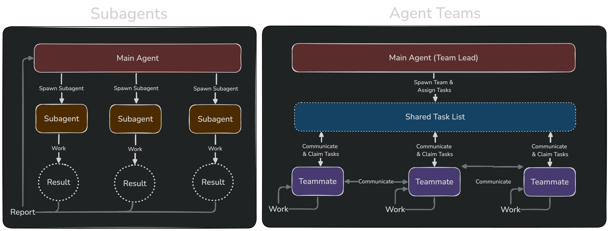

# Agent Team

## 1. Agent Team 怎么组成的

agent team = 1 个 leader + 0 到多个 teammates + 一套共享状态和消息协议

这里对 team 的定义，不是“临时多开几个 agent”，而是“多个成员共享任务、可以互相通信、可以长期协作”，也就是说，它们不是各自干各自的，而是围绕同一套 task list、同一套消息机制和同一份团队状态在一起工作。

## 2. Agent Team 怎么工作的

### 2.1 创建 Agent Team

创建 team 的时候，系统会先把这套机制需要的基础数据准备好，这里面最重要的通常有三样：成员名单、共享任务列表，还有 leader 在当前会话里看到的 team 状态。

成员名单会放在 team file 里，它记录的是这个 team 到底有谁、谁是 leader、每个成员是什么类型、是不是还活着、当前挂在哪个 session 上。

所以这个文件的作用，不只是“存一份配置”，而是让 team 不会只存在于当前这一轮对话里，而是有一份稳定的本地状态可以持续被读写。

共享任务列表会放在 `tasks` 目录里，它解决的是“这支 team 现在到底在做什么”这个问题。

谁创建任务、谁领取任务、谁完成任务，都会写进这套共享文件里，这样 leader 和 teammate 围绕的是同一份工作池，而不是每个人都只看自己手上的待办。

新 teammate 加入的时候，也需要先登记到 team file 里，因为后面的 mailbox、task list、权限处理、生命周期管理，都得先知道“团队里确实有这个成员”，不然很多逻辑根本接不上。

这里通常可以分成两层来看：一层是 `team config`，它负责保存整个 team 共享的成员信息；另一层是当前会话里的 `teamContext`，它负责让当前这个 leader 或 teammate 知道，自己现在应该怎么理解和使用这份 team 状态。

所以前者更偏长期共享状态，后者更偏当前运行时视图。

成员启动的方式一般也分两种：

- `process teammate`：把成员身份参数带进 CLI，启动一个独立的 Claude Code session。
- `in-process teammate`：不新开进程，而是在当前进程里直接拉起一个隔离的 teammate runtime。

这两种方式的差别，不只是“是不是新开一个会话”，而是后面整套身份注入和运行方式都会不一样。

`process teammate` 的第一条 prompt 不是在启动命令里直接塞进去，而是等 session 起好之后再通过 mailbox 发过去；`in-process teammate` 则是直接进入 runner。

所以虽然启动方式不同，但真正算“加入 team”，其实是从它能用统一身份读 team file、共享 task list、接入同一套 mailbox 协议开始的。

### 2.2 Agent Team 如何协同工作

team 真正协作起来，主要靠两套东西：一套是共享 task list，另一套是 mailbox。

共享 task list 负责公开工作，也就是先把任务放到共享列表里，再让成员自己去看能不能接、该不该接，所以它解决的不是“消息怎么传”，而是“这支 team 当前公开有哪些活，谁可以去做”。

mailbox 负责控制类消息，比如 shutdown、plan approval、permission request，还有普通成员消息，都会通过 mailbox 来回传递。

所以 team 不是靠共享内存合作，而是靠共享文件和消息文件合作，这一点很关键，因为它决定了这套协作机制更偏显式状态，而不是隐式状态。

mailbox 里的消息通常还会有明确的优先级，这一点在很多实现里都会写得很清楚，比如：

- `shutdown` 要最高优先级，不然成员可能本来该停却还在继续干活。
- team lead 的消息要优先于 peer 消息，因为它代表用户当前意图和协调命令。
- peer-to-peer chatter 虽然也重要，但如果它太多，就可能把真正关键的控制消息压住。

这个顺序为什么重要，其实很好理解，因为 mailbox 里的很多东西都比 task pool 更急：

- `shutdown_request` 不先处理，成员可能会继续跑。
- leader 的控制消息不先处理，成员可能会沿着错误方向继续做。
- 权限、模式、审批这类消息不先处理，成员可能根本没法继续执行。

所以一般只有这些控制面消息都没有挡路了，成员才适合回到任务池里接新活。

### 2.3 Process Teammate 和 In-Process Teammate 的区别

如果把这两类 teammate 放在一起看，核心区别其实就是一句话：这个 teammate 到底跑在哪儿。

- process teammate 是独立进程，通常会开新 pane、新终端，或者新子进程启动，所以它需要在启动参数里先把自己的身份带进去，不然这个新进程一开始根本不知道自己是谁。
- in-process teammate 不是新进程，它就是在当前这个进程里并发执行另一条 agent 任务，所以它没法靠 CLI 启动参数区分自己，只能在运行时给这条执行链挂一个隔离上下文，比如用 AsyncLocalStorage 这类机制来隔离状态。

所以这里的差别，不只是“有没有新窗口”，而是运行位置、身份注入方式、状态隔离方式、生命周期管理方式，都会跟着一起变。

### 2.4 怎么解决并发冲突

多个 agent 一起跑时，并发冲突基本绕不过去，所以这套机制至少要处理两类问题：

- 执行上下文隔离，防止多个 teammate 并发运行时因为全局变量或者共享状态互相污染。
- 任务系统并发，防止两个 agent 同时抢同一个 task。

再往代码工作流里看，项目本身一般还会支持 `same-dir` 和 `worktree` 两种模式。

其中，`same-dir` 是多个 agent 共用当前目录，而 `worktree` 是每个 session 一个独立 git worktree，所以后者的思路其实很直接，就是让多个 agent 先在各自的工作副本里改，再由 leader 去做 Git 层面的合并。

- 每个 worktree 有自己的工作目录
- 每个 worktree 通常对应自己的分支
- 但它们共享同一个 Git 对象库，而不是完整复制一份 `.git` 历史

从 Git 视角看，worktree 目录里会有一份独立的 working tree，但它的 `.git` 往往不是完整目录，而是一个指针文件，指向主仓库里的 `.git/worktrees/...`。

所以这种模式的核心价值，不是“完全避免冲突”，而是把原来那种运行时直接覆盖文件的冲突，尽量变成版本控制里的合并冲突，因为后者至少更容易被看见、被管理、也更符合工程习惯。

### 2.5 整个 Agent Team 可以拆成哪几层

如果把这套机制继续往下拆，大致可以分成四层，也就是 `team config`、`task list`、`mailbox`，还有当前会话里的 `AppState.teamContext`。

- `team config` 主要管“这个 team 里有哪些成员，他们的身份是什么”，而且它得放在磁盘上，不然进程一重启，成员关系就断了。
- `task list` 主要管“现在有哪些公开任务，谁领了，谁做完了”，而且它要能被多个成员一起改，所以通常会单独做成一套文件集合，必要时还会加锁。
- `mailbox` 主要管“谁给谁发了什么控制消息”，比如关机请求、权限请求、计划审批这些，它和 task list 不是一回事，因为 task list 适合放公开状态，不适合放这种收发对象很明确的一来一回消息。
- `AppState.teamContext` 则是当前会话里的本地 team 视图，它不是长期存档，而是当前进程手边正在用的 team 状态投影，像“我要不要轮询 inbox”“我要按谁的名字收消息”“我自己是不是 leader”这类判断，很多都要靠它。

换句话说，这四层虽然都在服务同一个 Agent Team，但职责并不一样：`team config` 管成员身份，`task list` 管公开任务，`mailbox` 管控制消息，`teamContext` 管当前会话怎么理解并使用这支 team。

## 3. Agent Team 关闭

Agent Team 关闭时，通常不会一步直接删掉，而是先通过 `shutdown_request` 让各个 teammate 正常停止，等成员都停掉之后，再用 `TeamDelete` 之类的动作去清理整个 team。

所以这里更合理的顺序通常是：

- 先检查还有没有 active 成员。
- 如果还有，就先拒绝清理，并提示先把 teammates 关掉。
- 只有当成员都不活跃了，才真正删除 team 目录、清掉 task list 关联、清空 teamContext。

因为如果 team 状态已经删了，但某些 teammate 其实还在跑，后面会非常难收拾。
